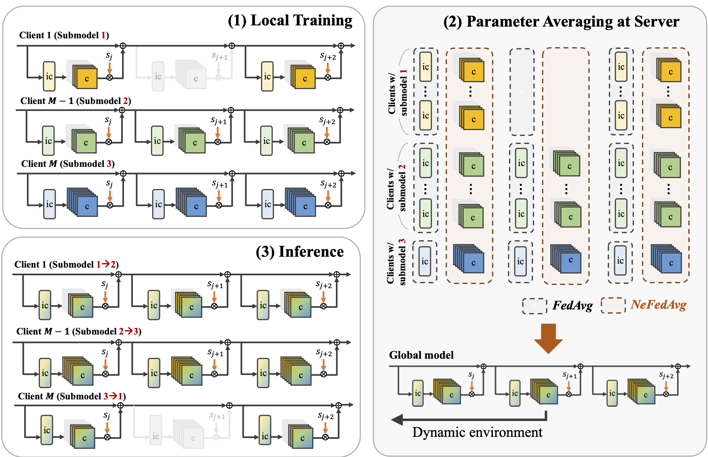

# NeFL: Nested Model Scaling for Federated Learning with System Heterogeneous Clients

### [Honggu Kang] &nbsp;&nbsp; [Seohyeon Cha] &nbsp;&nbsp; [Jinwoo Shin] &nbsp;&nbsp; [Jongmyeong Lee] &nbsp;&nbsp; [Joonhyuk Kang]  
### [KAIST (Korea Advanced Institute of Science and Technology)]  
### [[Paper]] &nbsp;&nbsp; [[Code]]

---
<!-- 

    <a href="https://honggkang.github.io/about/">Honggu Kang</a>1, &nbsp;
    <a href="https://seohyeon-cha.github.io/">Seohyeon Cha</a>1, &nbsp;
    <a href="https://alinlab.kaist.ac.kr/shin.html" style="text-decoration:none;">Jinwoo Shin</a>1, &nbsp;
    Jongmyeong Lee1, &nbsp;
    <a href="https://artlab.kaist.ac.kr/bbs/board.php?bo_table=sub1_1">Joonhyuk Kang</a>1,

     
    
        1 KAIST &nbsp; &nbsp; &nbsp;
    
     

    <a href="https://arxiv.org/abs/2308.07761">
        [<b>Paper</b>]
    </a>
    &nbsp;&nbsp;&nbsp;&nbsp;&nbsp;&nbsp;
    <a href="https://github.com/honggkang/nested-federated-learning">
    [<b>Code</b>]
    </a> 

 -->

 

### TL;DR
NeFL divides a model into submodels by widthwise or/and depthwise and aggregate the knowledge of submodels.

### Abstract
  Federated learning (FL) is a promising approach in distributed learning keeping privacy.
  However, during the training pipeline of FL, slow or incapable clients (i.e., stragglers) slow down the total training time and degrade performance. To mitigate the impact of stragglers, system heterogeneity, including heterogeneous computing and network bandwidth, has been addressed.
  Previous studies tackle the system heterogeneity by splitting a model into submodels, but with less degree-of-freedom in terms of model architecture. We propose nested federated learning (NeFL), a generalized framework that efficiently divides a model into submodels using both depthwise and widthwise scaling. NeFL is implemented by interpreting forward propagation of models as solving ordinary differential equations (ODEs) with adaptive step sizes. To address the inconsistency that arises when training multiple submodels of different architecture, we decouple a few parameters from parameters being trained for each submodel.
  NeFL enables resource-constrained clients to effectively join the FL pipeline and the model to be trained with a larger amount of data. Through a series of experiments, we demonstrate that NeFL leads to significant performance gains, especially for the worst-case submodel.
  Furthermore, we demonstrate NeFL aligns with recent studies in FL, regarding pre-trained models of FL and the statistical heterogeneity.

----
[Honggu Kang]: https://honggkang.github.io/about/
[Seohyeon Cha]: https://seohyeon-cha.github.io/
[Jongmyeong Lee]: https://
[Jinwoo Shin]: https://alinlab.kaist.ac.kr/shin.html
[Joonhyuk Kang]: https://artlab.kaist.ac.kr/bbs/board.php?bo_table=sub1_1
[KAIST (Korea Advanced Institute of Science and Technology)]: https://kaist.ac.kr/
[Paper]: https://arxiv.org/abs/2308.07761
[Code]: https://github.com/honggkang/nested-federated-learning
