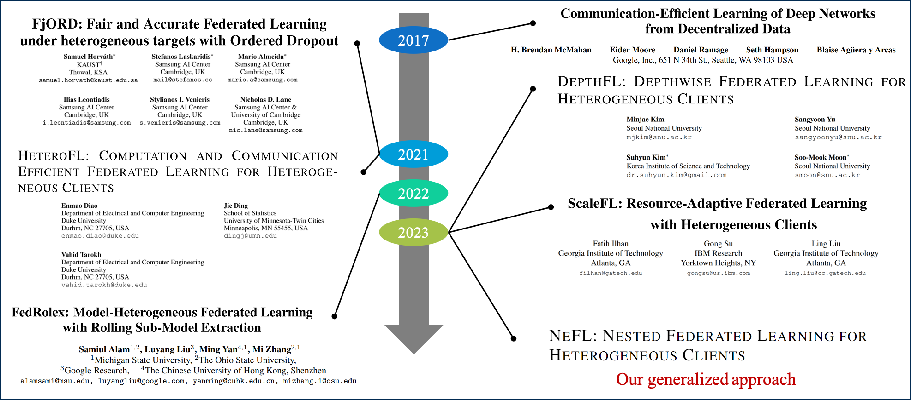

# NeFL: Nested Model Scaling for Federated Learning with System Heterogeneous Clients

### [Honggu Kang] &nbsp;&nbsp; [Seohyeon Cha] &nbsp;&nbsp; [Jinwoo Shin] &nbsp;&nbsp; [Jongmyeong Lee] &nbsp;&nbsp; [Joonhyuk Kang]  
### [KAIST (Korea Advanced Institute of Science and Technology)]  
### [[Paper]] &nbsp;&nbsp; [[Code]]

 

### TL;DR
NeFL divides a model into submodels by widthwise or/and depthwise introducing inconsistent parameters. Then, NeFL aggregates the knowledge of submodels.

### Abstract

Federated learning (FL) enables distributed training while preserving data privacy, but stragglers—slow or incapable clients—can significantly slow down the total training time and degrade performance. To mitigate the impact of stragglers, system heterogeneity, including heterogeneous computing and network bandwidth, has been addressed.
While previous studies have addressed system heterogeneity by splitting models into submodels, they offer limited flexibility in model architecture design without considering potential inconsistencies arising from training multiple submodel architectures.
We propose *nested federated learning (NeFL)*, a generalized framework that efficiently divides deep neural networks into submodels using both depthwise and widthwise scaling. NeFL interprets forward propagation as solving ordinary differential equations (ODEs) with adaptive step sizes, allowing for dynamic submodel architectures. To address the inconsistency arising from training multiple submodel architectures, NeFL decouples a subset of parameters from those being trained for each submodel. An averaging method is proposed to handle these decoupled parameters during aggregation.
NeFL enables resource-constrained devices to effectively participate in the FL pipeline, facilitating larger datasets for model training. Experiments demonstrate that NeFL achieves performance gain, especially for the worst-case submodel compared to baseline approaches. Furthermore, NeFL aligns with recent advances in FL, such as leveraging pre-trained models and accounting for statistical heterogeneity. Our code is available online: https://honggkang.github.io/nefl.

----
[Honggu Kang]: https://honggkang.github.io/about/
[Seohyeon Cha]: https://seohyeon-cha.github.io/
[Jongmyeong Lee]: https://
[Jinwoo Shin]: https://alinlab.kaist.ac.kr/shin.html
[Joonhyuk Kang]: https://artlab.kaist.ac.kr/bbs/board.php?bo_table=sub1_1
[KAIST (Korea Advanced Institute of Science and Technology)]: https://kaist.ac.kr/
[Paper]: https://arxiv.org/abs/2308.07761
[Code]: https://github.com/honggkang/nested-federated-learning
